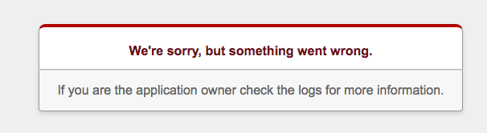

# Delmo demo - Step 2

In this step we will containerize this Rails app using Docker, and run a small `docker-compose` cluster with this `web` app linked to a PostgreSQL `db` container.

```
docker-compose up
```

View the application at https://docker-ip:5000


To show the "missing database" issue, in another terminal window run:

```
docker-compose stop db
```

The `docker-compose` terminal will show the `db` container stopping:

```
db_1   | ERROR:  database "myapp_test" already exists
db_1   | STATEMENT:  CREATE DATABASE "myapp_test" ENCODING = 'unicode'
db_1   | LOG:  received smart shutdown request
db_1   | LOG:  autovacuum launcher shutting down
delmorailspgdemo_db_1 exited with code 137
```

Now view the application again at https://docker-ip:5000 and it should fail.



Sadly, our production Rails app isn't even very communicative about the issue (which we caused):

```
web_1  | Started GET "/" for 110.143.157.94 at 2017-05-24 00:28:50 +0000
web_1  | Cannot render console from 110.143.157.94! Allowed networks: 127.0.0.1, ::1, 127.0.0.0/127.255.255.255
web_1  | Processing by HomeController#index as HTML
web_1  |   Rendering home/index.html.erb within layouts/application
web_1  |   Rendered home/index.html.erb within layouts/application (33.8ms)
web_1  | Completed 500 Internal Server Error in 37ms (ActiveRecord: 0.0ms)
```

## Cleanup

Press `Ctrl-C` to cancel the `docker-compose up` app and the remaining docker containers will stop,

To delete the containers:

```
docker-compose rm
```

## Next

Next we will introduce Delmo to show this failure case within a simple test.

```
git checkout step-3
cat README.md
```
