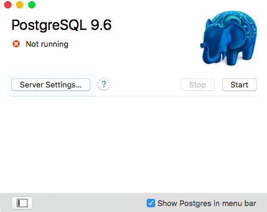
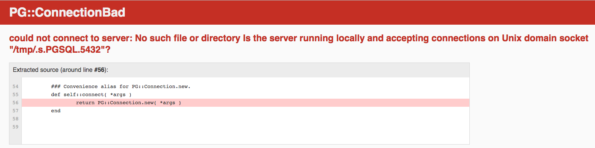

# Delmo demo - Step 1

This is a normal Rails app. It requires PostgreSQL locally. If you don't have Ruby and/or PostgreSQL setup, then fear not - just [skip to the next step](#next) where we dockerize it all.

```
bundle install
bin/rails s
```

View the application at https://localhost:3000


Now, stop/disable your local PostgreSQL service.

If using [Postgres.app](https://postgresapp.com/), press the Stop button:



View the application at https://localhost:3000 again and it will fail - the Rails app requires access to the database for every incoming request.

The error might look similar to, or a variation of some internal error:



## Next

In the next step we will containerize this Rails app using Docker, and run a small `docker-compose` cluster with this `web` app linked to a PostgreSQL `db` container.

```
git checkout step-2
cat README.md
```
